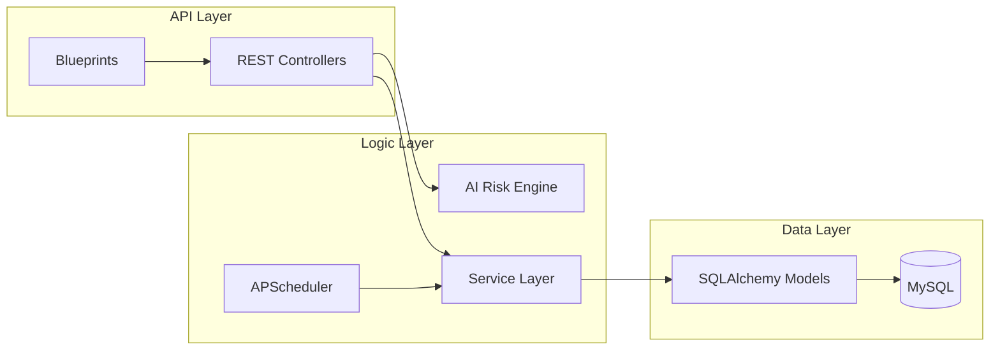

# ⚙️ ResolveIQ Backend: AI & Automation Engine

[](https://www.python.org/)
[](https://flask.palletsprojects.com/)
[](https://www.mysql.com/)
[](https://opensource.org/licenses/MIT)

**ResolveIQ Backend** is the high-performance intelligence layer of the ResolveIQ ecosystem. It handles complex ticket orchestration, real-time AI risk assessment, and autonomous SLA management through a robust Flask-based micro-architecture.

---

## 🧠 Advanced AI Risk Engine

The core of ResolveIQ is a modular, weighted **Hybrid Intelligence Model** that provides explainable risk assessment for every ticket.

### ⚖️ Weighted Scoring Algorithm
The engine calculates a **Risk Score (0-100)** by analyzing textual patterns across five distinct dimensions:

| Dimension | Weight | Description |
| :--- | :---: | :--- |
| **Severity** | 40% | Detects critical failure keywords (e.g., "outage", "crashed", "security breach"). |
| **Impact** | 20% | Analyzes the scope of the issue (e.g., "entire floor", "all users", "company-wide"). |
| **Urgency** | 15% | Identifies temporal signals (e.g., "ASAP", "immediately", "right now"). |
| **History** | 15% | Factors in recurring issues or historically problematic departments. |
| **Complexity**| 10% | Assesses technical depth based on description detail and metadata. |

- **Explainable AI**: Every score comes with a natural language summary explaining *why* a ticket was flagged (e.g., "High-impact scope detected in IT Support").
- **Dynamic Normalization**: Ensures that scores are statistically balanced to prevent false positives while capturing critical anomalies.

---

## ⚙️ Autonomous Background Workflows

ResolveIQ features a **Self-Healing Automation Layer** powered by `APScheduler`, ensuring that no ticket is left behind.

### 🕒 Real-Time Task Orchestration
- **SLA Breach Guard (Every 5 min)**: Automatically detects tickets nearing or exceeding their deadlines.
- **Auto-Escalation Logic**: If a breach occurs, the system autonomously elevates the priority to `P1` and triggers an `AUTO_ESCALATED` audit event.
- **Queue Cleanup (Every 1 min)**:
    - **Auto-Approval**: Moves `OPEN` tickets to `APPROVED` after 15 minutes of inactivity to ensure visibility.
    - **Auto-Resolution**: Finalizes `RESOLVED` tickets into `CLOSED` status after 10 minutes, maintaining a clean workspace.

---

## 🏗 Industrial Architecture

Designed for scalability and maintainability.



### 🔒 Enterprise Security
- **RBAC (Role-Based Access Control)**: Granular decorators ensure only authorized roles (Admin, Lead, Agent, Employee) can access specific sensitive endpoints.
- **JWT Authentication**: Stateless, secure communication across all client interactions.
- **Audit Logging**: Comprehensive system activity tracking for compliance and transparency.

---

## 🚀 Deployment & Installation

### 📋 Prerequisites
- Python 3.8+
- MySQL Server (XAMPP recommended)
- Virtual Environment (`venv`)

### 🛠 Setup Procedure
1. **Repository Setup**:
   ```bash
   git clone https://github.com/Anil3737/ResolveIQ_backend.git
   cd resolveiq_backend
   python -m venv venv
   source venv/bin/activate  # On Windows: venv\Scripts\activate
   ```
2. **Install Dependencies**:
   ```bash
   pip install -r requirements.txt
   ```
3. **Database Initialization**:
   ```bash
   python create_db.py     # Create schema
   python seed_database.py # Seed initial departments and initial admin
   ```
4. **Environment Configuration**:
   Create a `.env` file based on the local environment requirements (DB_USER, DB_PASSWORD, SECRET_KEY).

5. **Run Service**:
   ```bash
   python main.py
   ```

---

## 👨‍💻 Developed By

**J Chiranjevi Anil**  
*Computer Science & Engineering*  
**SIMATS (Saveetha Institute of Medical and Technical Sciences)**

---


